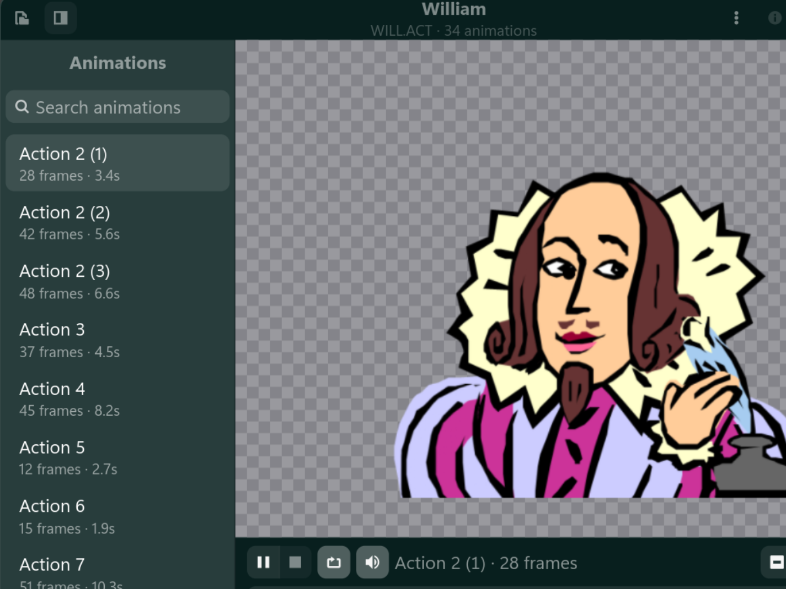

# Agent Viewer

A native GNOME viewer for Microsoft Agent (`.acs`) and Microsoft Actor (`.act`)
character files — the formats behind Clippit, Merlin, Peedy, Microsoft Bob and
the rest of the late-90s desktop assistants.



Open a character, browse its animations, play them with their original sound
effects, and make it talk: text is spoken with espeak-ng by default (or Kokoro)
and shown in the character's own word balloon, with the mouth driven from the
synthesized audio.

* GTK 4 + libadwaita, running natively on Wayland
* Frames are composited from the character's palette and drawn as GPU textures
  through GSK, which uses the Vulkan renderer
* ACS containers, proprietary compression, and 8-bit DIBs are decoded natively,
  as are Actor's embedded Windows Metafiles, which are drawn by a built-in
  anti-aliased rasterizer

## Building

Needs Rust, GTK 4 and libadwaita development files:

```sh
cargo build --release
```

Runtime dependencies: `espeak-ng` for default speech, or
[`kokoro-tts`](https://github.com/nazdridoy/kokoro-tts) when using `--tts kokoro`,
and one of `paplay`
(PulseAudio / PipeWire), `pw-play` or `aplay` for audio playback.

## Using it

```sh
./target/release/agentview                      # start empty, then Ctrl+O
./target/release/agentview Clippit.acs
./target/release/agentview ROVER.ACT
./target/release/agentview Peedy.acs --animation Confused --say "Hello there!"
./target/release/agentview Peedy.acs --tts kokoro --say "Hello there!"
```

| Option | |
|---|---|
| `-a`, `--animation NAME` | play this animation once the character loads |
| `-s`, `--say TEXT` | speak this text once the character loads |
| `--tts ENGINE` | speech engine: `espeak-ng` (default) or `kokoro` |
| `--kokoro-voice ID` | Kokoro voice ID; defaults based on the character's gender |
| `-h`, `--help` | usage |

Characters can also be dropped onto the window.

| Shortcut | |
|---|---|
| <kbd>Ctrl</kbd>+<kbd>O</kbd> | open a character |
| <kbd>Ctrl</kbd>+<kbd>I</kbd> | character details |
| <kbd>Space</kbd> | play / pause |
| <kbd>F9</kbd> | toggle the animation list |

## Layout

```
crates/acs/     parsing and rendering, no UI dependencies
  decompress.rs the proprietary bit-level compressor
  reader.rs     little-endian cursor over the file image
  agent15.rs    Agent 1.5 OLE/ACF/AAF parsing
  actor.rs      Microsoft Bob and Office 97 ACT parsing and frame compositing
  wmf.rs        Windows Metafile parsing and anti-aliased rasterizing
  types.rs      ACS structures: character, animations, frames, images, audio
  render.rs     frame compositing to RGBA
  bin/acsdump   diagnostics: parse a file, decode every image, list
                animations, dump a frame
src/            the application
  stage.rs      the character widget: texture and word balloon as GSK nodes
  player.rs     frame timing, branch probabilities, looping
  speech.rs     espeak-ng/Kokoro synthesis and the amplitude envelope for lip sync
  audio.rs      WAVE playback and parsing
  window.rs     the window and everything wired to it
```

`acsdump` is useful on its own:

```sh
./target/release/acsdump Peedy.acs                          # summary + decode every image
./target/release/acsdump Peedy.acs --png Greet 0 out.png    # composite a frame
./target/release/acsdump Peedy.acs --png Greet 0 out.png --mouth 4   # with a mouth overlay
```

## Notes on the format

The layout follows the reverse-engineered *MSAgent Character Data
Specification*. An ACS file is a header of locators pointing at a character
description, an animation table, an image table and an audio table. Most
payloads are compressed with a custom LZ-style bit stream: literals and
back-references, with offset widths chosen by a short unary prefix and lengths
encoded as `2^n - 1` plus `n` trailing bits. The end-of-stream marker lives
inside the trailing `0xFF` bytes, so those are part of the stream rather than
padding to strip.

Images are 8-bit DIBs stored bottom-up against a shared palette, with one
palette entry designated transparent. A frame composites several of them,
last-to-first, and may carry mouth overlays that substitute in while the
character speaks.

Microsoft Agent 1.5 structured-storage files are supported, including their
compressed ACF/AAF streams, indexed frames and embedded WAVE sounds. Microsoft
Actor 1.0 files from Microsoft Bob and Actor 2.0 files from Office 97 are also
supported. `.acf` files whose animations live in separate `.aca`/`.aaf` files
still report a clear unsupported error.

Actor is a different shape from ACS. A frame is not a bitmap but a stack of
placeable Windows Metafiles, each with a rectangle on a 2880x2160 logical
canvas, so frames are drawn rather than decoded. Every metafile is rasterized
once at the largest size any frame draws it, cached, and composited at three
times the character's nominal 192x144 canvas, which keeps the artwork crisp
when the window scales it up. The rasterizer covers what these files actually
use — polygons, polylines, ellipses, rounded rectangles, indirect pens and
brushes, and the winding and alternate fill rules — with four-times vertical
supersampling and exact horizontal coverage for the anti-aliasing. The handful
of text records in the cast are not drawn.

An Actor animation is a list of six-byte slots, `id, value, flags`, where the
flags describe what follows: bit 0 chains a branch record whose value is a
probability out of `0x8000`, bit 1 appends a sound record naming an entry in the
audio table, and bit 8 ends the sequence. Branch targets address raw slots, and
the probabilities are a cascade — each takes its share of what the earlier ones
left — so both are resolved into plain frame indices and cumulative percentages
at parse time. The action table gives each sequence its name and variants.

Lip sync is approximate by necessity. Agent got viseme timings from SAPI 4;
neither espeak-ng nor Kokoro expose them, so the mouth follows the loudness
envelope of the rendered audio instead. Frames that lack a given mouth shape
fall back to the nearest one by openness.
